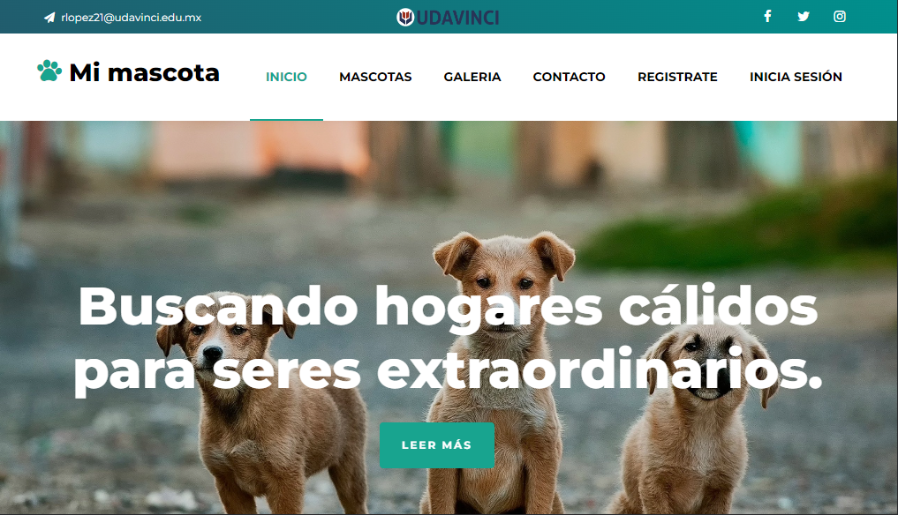

# Mi mascota
Esta es una aplicación web para la adopción de mascotas, donde los usuarios pueden buscar mascotas disponibles para adopción, crear perfiles de mascotas y enviar formularios de adopción.

Puedes visitar el sitio desde el siguiente [enlace](https://88randy.pythonanywhere.com/).



## Índice
- [Mi mascota](#mi-mascota)
  - [Índice](#índice)
  - [Funcionalidades](#funcionalidades)
  - [Tecnologías Utilizadas](#tecnologías-utilizadas)
  - [Modelos](#modelos)
  - [Requisitos](#requisitos)
  - [Instalación](#instalación)
  - [Variables de Entorno](#variables-de-entorno)
  - [Cómo contribuir](#cómo-contribuir)
  - [Licencia](#licencia)
  - [Autores](#autores)
  - [Agradecimientos](#agradecimientos)


## Funcionalidades

- Los usuarios pueden crear una cuenta y crear perfiles de mascotas para ser adoptados.
- Los usuarios pueden buscar mascotas disponibles para adopción por tipo, tamaño, género y edad.
- Los usuarios pueden ver detalles de la mascota, como su nombre, raza, edad, tamaño y descripción.
- Los usuarios pueden enviar formularios de adopción y recibir una respuesta del administrador.
- Los administradores pueden ver una lista de todos los formularios de adopción y aceptar o rechazar las solicitudes.
- Los administradores pueden agregar, editar y eliminar perfiles de mascotas.

## Tecnologías Utilizadas
- Python
- Django
- SQLite
- HTML
- CSS
- JavaScript
- Bootstrap


## Modelos
La aplicación cuenta con los siguientes modelos:

- CustomUser: modelo de usuario personalizado que hereda de AbstractBaseUser y PermissionsMixin.
- Pet: modelo que representa una mascota disponible para adopción.
- PetImage: modelo que representa una imagen asociada a una mascota.
- AdoptionForm: modelo que representa un formulario de solicitud de adopción.

## Requisitos
- Python 3.8 o superior
- Django 4.0 o superior
- SQLite o PostgreSQL 13.4 o superior
- Librerías detalladas en el archivo requirements.txt

## Instalación
- Clonar este repositorio:

    ```bash
    git clone https://github.com/88randy/pets.git
    ```
- Crear un entorno virtual: 
    ```bash
    python3 -m venv myvenv
    ```
- Activar el entorno virtual: 
  - Linux - Mac
  ```bash
    source myvenv/bin/activate
    ```
  - windows
  ```bash
    myvenv/Scripts/activate
    ```
- Instalar los requerimientos: 
    ```bash
    pip install -r requirements.txt
    ```
- Configurar las variables de entorno en un archivo .env
  - Linux - Mac
  ```bash
    cd pets
    touch .env
    vim .env
    ```
    Escribir las variables de entrono y guardar.
    ```vim
    SECRET_KEY = "django-insecure-jc1=bi04yq9t7b(i91jz-#g+ir72rr#q9%8=fuj1z#%@2ejzc48y41"
    EMAIL_HOST = "smtp.office365.com"
    EMAIL_PORT = 587
    EMAIL_HOST_USER = "email@email.com"
    EMAIL_HOST_PASSWORD = "my_password"
    ```
  - windows
  ```bash
    cd pets
    copy con .env

    SECRET_KEY = "django-insecure-jc1=bi04yq9t7b(i91jz-#g+ir72rr#q9%8=fuj1z#%@2ejzc48y41"
    EMAIL_HOST = "smtp.office365.com"
    EMAIL_PORT = 587
    EMAIL_HOST_USER = "email@email.com"
    EMAIL_HOST_PASSWORD = "my_password"
    ```
    Presionar ctl + z y luego Enter para guardar
- Realizar las migraciones:
    ```bash
    python manage.py migrate
    ```
- Crear un superusuario: 
    ```bash
    python manage.py createsuperuser
    ```
- Iniciar el servidor local:
    ```bash
    python manage.py runserver
    ```
- Ingresar al navegador en la siguiente ruta [http://127.0.0.1:8000](http://127.0.0.1:8000) para ver el resultado.


## Instalación con Docker

Para esta instalación se necesita tener Docker instalado.

- Clonar este repositorio:

    ```bash
    git clone https://github.com/88randy/pets.git
    ```

- Posicionarnos en la carpeta `pets` para crear la imagen
    ```bash
    cd pets
    docker build -t pets .
    docker run -p 8000:8000 -d --name pets-django pets
    ```
- Ingresar a la terminal del contenedor
  ```bash
  docker exec -it pets-django /bin/bash
  ```
- Realizar las migraciones:
    ```bash
    cd app/pets
    python manage.py migrate
    ```
- Crear un superusuario: 
    ```bash
    python manage.py createsuperuser
    ```
- Ingresar al navegador en la siguiente ruta [http://127.0.0.1:8000](http://127.0.0.1:8000) para ver el resultado.

## Variables de Entorno
- SECRET_KEY: clave secreta para Django. Puedes generar una clave desde este sitio [Generador de claves Django](https://djecrety.ir/)
- EMAIL_HOST: servidor de correo saliente.
- EMAIL_PORT: puerto del servidor de correo.
- EMAIL_HOST_USER: nombre de usuario del correo electrónico.
- EMAIL_HOST_PASSWORD: contraseña del correo electrónico.

## Cómo contribuir
Si deseas contribuir con esta aplicación, puedes hacer un fork del repositorio y enviar un pull request con tus cambios.

Por favor asegúrate de seguir los lineamientos de contribución y código de conducta del proyecto.

También puedes reportar errores o sugerir nuevas funcionalidades a través de los issues del repositorio.

## Licencia
Este proyecto está bajo la licencia MIT.

## Autores
Randy Allan

## Agradecimientos
Quiero agradecer a la Universidad por brindarme la oportunidad de aprender y desarrollar mis habilidades en diferentes ámbitos. Y en especial quiero agradecer a mi familia por su apoyo y motivación durante todo el proceso de mi Maestría y en el de desarrollo de esta aplicación. Sin su ayuda y aliento, esto no habría sido posible.